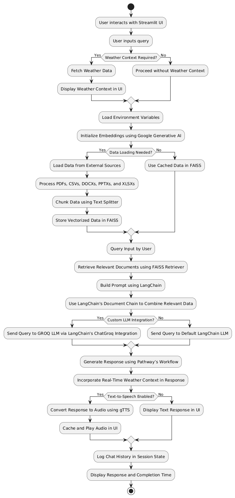
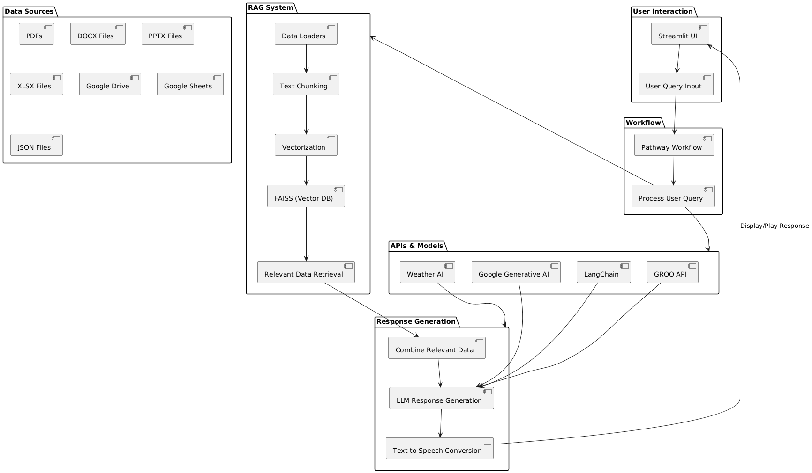

# Real-Time Personalized Health Advisory System

This project, **Pathway’s Real-Time Personalized Health Advisory System**, is a Streamlit-based application that provides personalized health advice using advanced AI technologies such as Pathway, LangChain, LlamaIndex, and Google APIs. The application integrates weather data, document retrieval systems, and voice-based interaction to deliver insightful, context-aware health recommendations.

---

## Table of Contents

1. [Introduction](#introduction)
2. [Technologies Used](#technologies-used)
   - [Pathway](#pathway)
   - [LangChain](#langchain)
   - [LlamaIndex](#llamaindex)
   - [Retrieval-Augmented Generation (RAG)](#retrieval-augmented-generation)
   - [Google API](#google-api)
   - [GROQ API](#groq-api)
3. [Workflow](#workflow)
4. [Features](#features)
5. [File Structure](#file-structure)
6. [Installation and Setup](#installation-and-setup)
7. [How to Use](#how-to-use)

---

# Project Title

## Overview

This project is focused on [brief description of your project]. The static folder contains all the relevant files, including the demo video that illustrates key features.

## Demo Video

You can watch the project demo here:

 <!-- Embed the video thumbnail (optional) -->

<video width="640" height="360" controls>
  <source src="static/demo.mp4" type="video/mp4">
  Your browser does not support the video tag.
</video>

## Folder Structure

- **static/**: Contains all static files like images, videos, etc.
  - **demo.mp4**: The demo video showing project functionality.

## How to Run

[Provide steps to run the project or how to access files.]

# Project Documentation

## Workflow Diagram



## Block Diagram



## Introduction

The Real-Time Personalized Health Advisory System is designed to assist users with health-related queries by:

- Processing user inputs in real-time.
- Retrieving relevant data from various sources (PDFs, CSVs, etc.).
- Integrating weather conditions into advice.
- Providing audio responses using text-to-speech functionality.

---

## Technologies Used

### Pathway

**Pathway** is a real-time data processing framework used to update data streams dynamically. It allows efficient updates to large-scale projects, ensuring timely and accurate recommendations.

### LangChain

**LangChain** is an AI framework designed for building powerful, end-to-end applications with large language models (LLMs). It facilitates:

- Document splitting and embeddings.
- Prompt management for AI models.
- Integration with retrieval systems.

### LlamaIndex

**LlamaIndex** (formerly known as GPT Index) provides a simple interface for connecting LLMs with external data sources like databases, PDFs, and web data.

### Retrieval-Augmented Generation (RAG)

**RAG** is a method of improving LLM responses by retrieving relevant external data and incorporating it into the response generation process. This ensures factual accuracy and reduces hallucinations.

### Google API

The application leverages the **Google Generative AI API** for generating embeddings and powering the document retrieval system.

### GROQ API

**GROQ API** integrates with AI models like `ChatGroq` to provide high-quality and domain-specific conversational responses.

---

## Workflow

1. **Data Loading**:

   - Extracts data from supported file formats (PDF, CSV, DOCX, PPTX, XLSX).
   - Processes and splits data into smaller chunks for better embedding generation.

2. **Embedding Creation**:

   - Uses Google Generative AI to create embeddings for processed data.

3. **Vector Store**:

   - Stores embeddings in a FAISS (Facebook AI Similarity Search) database for efficient retrieval.

4. **Weather Integration**:

   - Fetches real-time weather data using the OpenWeatherMap API.
   - Incorporates weather context into health recommendations.

5. **User Interaction**:

   - Users type their questions into a chat interface.
   - The system retrieves relevant data, processes the query, and generates personalized advice.

6. **Text-to-Speech**:
   - Converts bot responses to speech for a better user experience.

---

## Features

- Multimodal data processing from PDFs, CSVs, and more.
- Contextual health advice based on weather conditions.
- Real-time retrieval-augmented response generation.
- Voice-based interaction using GTTS.
- Easy-to-use chat interface for queries.

---

## File Structure

```plaintext
.
├── loaders/
│   ├── pdf_loader.py
│   ├── csv_loader.py
│   ├── docx_loader.py
│   ├── pptx_loader.py
│   ├── xlsx_loader.py
│   ├── json_loader.py
│   ├── dataGeneration.py
├── app.py  # Main application file
├── .env  # Environment variables (API keys)
├── requirements.txt  # Dependencies
└── README.md  # Documentation
```

---

## Installation and Setup

1. Clone the repository:

   ```bash
   git clone <repository_url>
   cd <repository_name>
   ```

2. Install dependencies:

   ```bash
   pip install -r requirements.txt
   ```

3. Set up environment variables in a `.env` file:

   ```env
   GOOGLE_API_KEY=your_google_api_key
   GROQ_API_KEY=your_groq_api_key
   ```

4. Run the application:
   ```bash
   streamlit run app.py
   ```

---

## How to Use

1. Open the Streamlit app in your browser.
2. Use the chat interface to ask health-related questions.
3. Check the sidebar for real-time weather data.
4. Press the 🔊 button to hear the assistant’s response.

---

## Contributing

We welcome contributions! Feel free to submit issues or pull requests.

---
